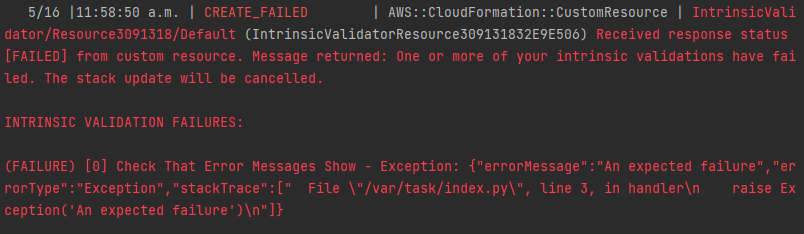

# CDK Intrinsic Validator

This CDK construct allows you to add intrinsic validation to your CDK stacks.
Adding intrinsic validation adds checks that occur during deployment that, if
they fail, will automatically roll back the stack.

**Example error**



## Intrinsic Validation Types

You can add the following intrinsic validations:

- Run Fargate tasks to test your system - if any fail, the stack rolls back.
- Monitor CloudWatch Alarms for a while and roll back if they alarm.
- Execute a step functions state machine and roll back if it fails.
- More to come. If you have any ideas and want to contribute, please open a
  feature request!

## Usage

```ts
// Create an ECS cluster to run some Fargate tasks in.
const cluster = new ecs.Cluster(stack, 'Cluster', /* ... */);

// Instantiate a convenience tool for creating Fargate validations with common
// options (i.e., a specific ecs cluster.)
const fargateValidations = new FargateValidationFactory(stack, 'FargateValidationFactory', {
  cluster,
});

// Let's do some testing with the curl container image.
const curlImage = ecs.ContainerImage.fromRegistry('curlimages/curl:7.78.0');

// Validate the stack on every deploy and fail the deployment if any of
// the given validations fail so that CloudFormation can auto-rollback.
new IntrinsicValidator(stack, 'IntrinsicValidator', {
  validations: [
    // Test some public endpoints to see if they respond to HTTP:
    fargateValidations.runContainer(curlImage, 'https://www.example.com/'),
    fargateValidations.runContainer(curlImage, 'https://www.amazon.ca/'),
    fargateValidations.runContainer(curlImage, 'https://www.google.com/'),
    // The following validations will fail and roll back the stack:
    // fargateValidations.runContainer(curlImage, 'https://fake.fake.fake/'),
    // Validation.alwaysFails(),
  ],
});
```

## Validate With Any Fargate Task

```ts
// Create an ECS cluster and Task Definition
const cluster = new Cluster(stack, 'Cluster', /* ... */);
const taskDefinition = new TaskDefinition(stack, 'TaskDefinition', /* ... */);
/* ... */

new IntrinsicValidator(stack, 'IntrinsicValidator', {
  validations: [
    // Use this generic interface to launch a Fargate task on the given cluster
    // from the given task definition. If the task run fails, the stack
    // deployment will cancel and roll back.
    Validation.fargateTaskSucceeds({
      cluster,
      taskDefinition,
      // ... other options:
      // assignPublicIp: ...,
      // containerOverrides: ...,
      // securityGroups: ...,
      // subnets: ...,
    }),
  ],
});
```

## Monitor a CloudWatch Alarm

```ts
// Create a CloudWatch Alarm
const alarm = new Alarm(stack, 'MyAlarm', /* ... */);

new IntrinsicValidator(stack, 'IntrinsicValidator', {
  validations: [
    // Monitor the given alarm for five minutes before allowing the deployment
    // to complete. If the alarm starts sounding while intrinsic validation is
    // monitoring it, the stack will roll back automatically.
    Validation.monitorAlarm({
      alarm,
      duration: cdk.Duration.minutes(5),
    }),
  ],
});
```

## Execute a Step Functions State Machine

```ts
// Create a CloudWatch Alarm
const stateMachine = new StateMachine(stack, 'MyStateMachine', /* ... */);

new IntrinsicValidator(stack, 'IntrinsicValidator', {
  validations: [
    // Execute the given step function and if it fails, cancel and roll back
    // the deployment.
    Validation.stateMachineExecutionSucceeds({
      stateMachine,
      // Input is optional
      input: TaskInput.fromObject({
        anything: 'you need',
      }),
    }),
  ],
});
```